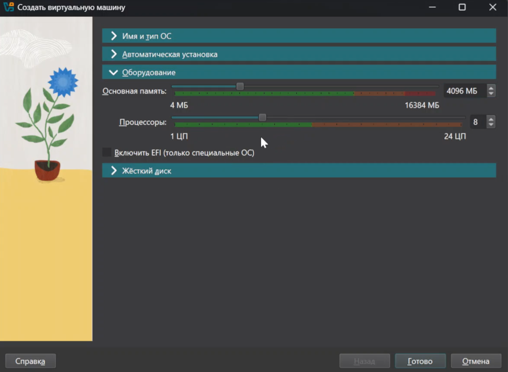

---
## Front matter
lang: ru-RU
title: Лабораторная работа
subtitle: Номер 1
author:
  - Андрюшин Н. С. 
institute:
  - Российский университет дружбы народов, Москва, Россия
date: 01 января 1970

## i18n babel
babel-lang: russian
babel-otherlangs: english

## Formatting pdf
toc: false
toc-title: Содержание
slide_level: 2
aspectratio: 169
section-titles: true
theme: metropolis
header-includes:
 - \metroset{progressbar=frametitle,sectionpage=progressbar,numbering=fraction}

## Fonts
mainfont: IBM Plex Serif
romanfont: IBM Plex Serif
sansfont: IBM Plex Sans
monofont: IBM Plex Mono
mathfont: STIX Two Math
mainfontoptions: Ligatures=Common,Ligatures=TeX,Scale=0.94
romanfontoptions: Ligatures=Common,Ligatures=TeX,Scale=0.94
sansfontoptions: Ligatures=Common,Ligatures=TeX,Scale=MatchLowercase,Scale=0.94
monofontoptions: Scale=MatchLowercase,Scale=0.94,FakeStretch=0.9
mathfontoptions:
---

# Информация

## Докладчик

:::::::::::::: {.columns align=center}
::: {.column width="70%"}

  * Андрюшин Никита Сергеевич
  * Студент
  * Российский университет дружбы народов

:::
::: {.column width="30%"}

:::
::::::::::::::

## Цель работы

Целью данной работы является приобретение практических навыков установки операционной системы на виртуальную машину, настройки минимально необходимых для дальнейшей работы сервисов.

## Первичная настройка машины

Для начала укажем имя виртуальной машины и укажем загрузочный диск 

{height=60%}

## Задача виртуальных ресурсов

Укажем 4096мб оперативной памяти и 8 ядер процессора 

{height=60%}

## Установка виртуального жёсткого диска

Создадим виртуальный жёсткий диск размером 40гб

{height=60%}

## Способ установки ВМ

Запустим ВМ, и выберем способ установки как Server with GUI и установим development tools 

{height=60%}

## Выбор диска

Выберем диск для установки диск 

{height=60%}

## Настройка Network

Далее настроим Network

{height=60%}

## Создание пользователя

Создадим пользователя с правами администратора

{height=60%}

## Отключение kdump

И отключим kdump

{height=60%}

## Пароль для root

Зададим пароль для root 

{height=60%}

## Установка vbox guest additions

После этого установим систему. После перезагрузки установим vbox guest additions 

{height=60%}

## dmesg

С помощью dmesg посмотрим на версию ядра 

{height=60%}

## dmesg

С его же помощью посмотрим частоту процессора, модель процессора, кол-во оперативной памяти, гипервизор, и типы файловых систем и их порядок загрузки 

{height=60%}

## Выводы

В результате выполнения лабораторной работы была установлена и настроена виртуальная машина
