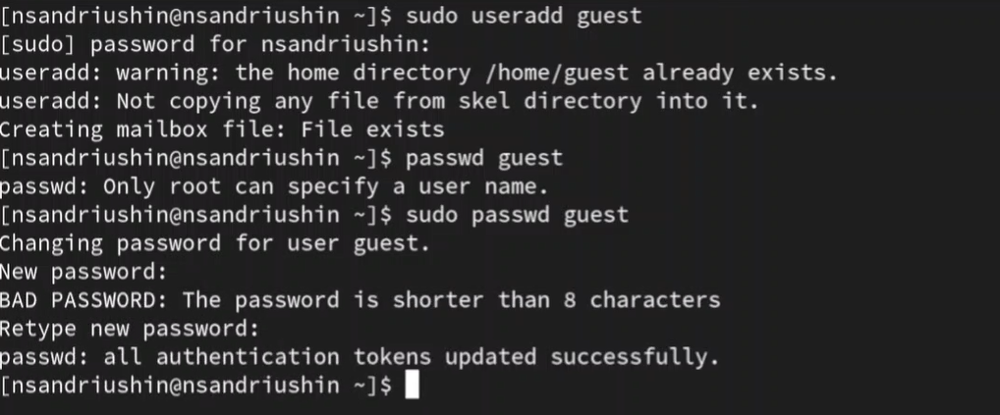
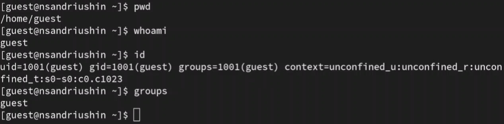

---
## Front matter
lang: ru-RU
title: Лабораторная работа
subtitle: Номер 2
author:
  - Андрюшин Н. С. 
institute:
  - Российский университет дружбы народов, Москва, Россия
date: 01 января 1970

## i18n babel
babel-lang: russian
babel-otherlangs: english

## Formatting pdf
toc: false
toc-title: Содержание
slide_level: 2
aspectratio: 169
section-titles: true
theme: metropolis
header-includes:
 - \metroset{progressbar=frametitle,sectionpage=progressbar,numbering=fraction}

## Fonts
mainfont: IBM Plex Serif
romanfont: IBM Plex Serif
sansfont: IBM Plex Sans
monofont: IBM Plex Mono
mathfont: STIX Two Math
mainfontoptions: Ligatures=Common,Ligatures=TeX,Scale=0.94
romanfontoptions: Ligatures=Common,Ligatures=TeX,Scale=0.94
sansfontoptions: Ligatures=Common,Ligatures=TeX,Scale=MatchLowercase,Scale=0.94
monofontoptions: Scale=MatchLowercase,Scale=0.94,FakeStretch=0.9
mathfontoptions:
---

# Информация

## Докладчик

:::::::::::::: {.columns align=center}
::: {.column width="70%"}

  * Андрюшин Никита Сергеевич
  * Студент
  * Российский университет дружбы народов

:::
::: {.column width="30%"}

:::
::::::::::::::

## Цель работы

Получение практических навыков работы в консоли с атрибутами файлов, закрепление теоретических основ дискреционного разграничения доступа в современных системах с открытым кодом на базе ОС Linux

## Создание пользователя

Создадим пользователя guset

{height=60%}

## id и groups

Войдём под его именем и посмотрим на текущую директорию. Как видим, она является домашней. После этого убедимся в том, что мы guest. После этого посмотрим и сравним выводы команд id и groups. Как видим, groups указывает только имя группы, без id 

{height=60%}

## Просмотр прав и атрибутов

Найдём те же данные о пользователе в файле passwd Как видим, тут только айди пользователя и групп. Далее, выведем содержимое папки home. Тут только 2 папки пользоавтелей, и только пользователи-владельцы имеют права на чтение запись и исполнение. Посмотрим на атрибуты этих папок. Как видим, к чужой папке нельзя получить атрибуты 

{height=60%}

## Работа с правами папки

Создадим в своей домашней дирктории папку dir1 и посмотрим, что она успешно создалась и узнаем дискреционные права и расширенные атрибуты. После этого обнулим все права и посмотрим, можем ли мы создавать там файлы и записывать в них что-то. Как видим, нельзя,что логично

{height=60%}

## Выводы

В результате выполнения лабораторной работы были получены навыки работы с дискреционными правами
