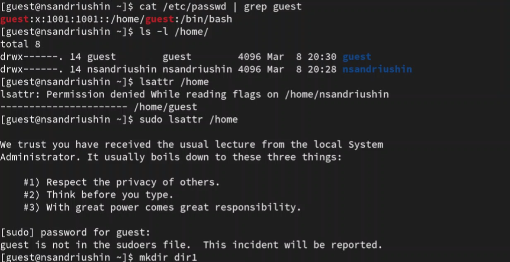
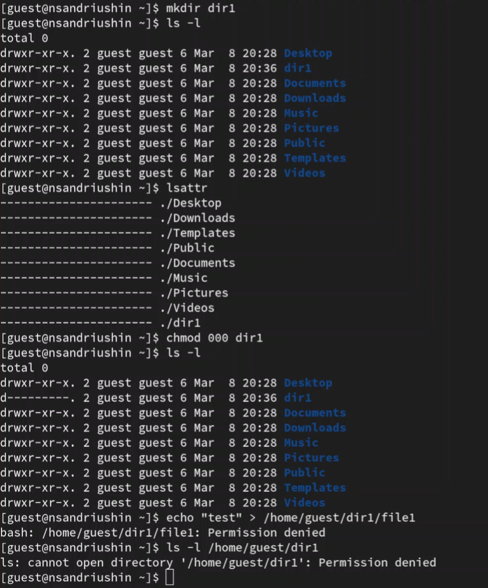

---
## Front matter
title: "Отчёт о лабораторной работе"
subtitle: "Лабораторная работа 2"
author: "Андрюшин Никита Сергеевич"

## Generic otions
lang: ru-RU
toc-title: "Содержание"

## Bibliography
bibliography: bib/cite.bib
csl: pandoc/csl/gost-r-7-0-5-2008-numeric.csl

## Pdf output format
toc: true # Table of contents
toc-depth: 2
lof: true # List of figures
lot: true # List of tables
fontsize: 12pt
linestretch: 1.5
papersize: a4
documentclass: scrreprt
## I18n polyglossia
polyglossia-lang:
  name: russian
  options:
	- spelling=modern
	- babelshorthands=true
polyglossia-otherlangs:
  name: english
## I18n babel
babel-lang: russian
babel-otherlangs: english
## Fonts
mainfont: IBM Plex Serif
romanfont: IBM Plex Serif
sansfont: IBM Plex Sans
monofont: IBM Plex Mono
mathfont: STIX Two Math
mainfontoptions: Ligatures=Common,Ligatures=TeX,Scale=0.94
romanfontoptions: Ligatures=Common,Ligatures=TeX,Scale=0.94
sansfontoptions: Ligatures=Common,Ligatures=TeX,Scale=MatchLowercase,Scale=0.94
monofontoptions: Scale=MatchLowercase,Scale=0.94,FakeStretch=0.9
mathfontoptions:
## Biblatex
biblatex: true
biblio-style: "gost-numeric"
biblatexoptions:
  - parentracker=true
  - backend=biber
  - hyperref=auto
  - language=auto
  - autolang=other*
  - citestyle=gost-numeric
## Pandoc-crossref LaTeX customization
figureTitle: "Рис."
tableTitle: "Таблица"
listingTitle: "Листинг"
lofTitle: "Список иллюстраций"
lotTitle: "Список таблиц"
lolTitle: "Листинги"
## Misc options
indent: true
header-includes:
  - \usepackage{indentfirst}
  - \usepackage{float} # keep figures where there are in the text
  - \floatplacement{figure}{H} # keep figures where there are in the text
---

# Цель работы

Получение практических навыков работы в консоли с атрибутами файлов, закрепление теоретических основ дискреционного разграничения доступа в современных системах с открытым кодом на базе ОС Linux

# Выполнение лабораторной работы

Создадим пользователя guset (рис. [-@fig:001]).

{#fig:001}

Войдём под его именем и посмотрим на текущую директорию. Как видим, она является домашней. После этого убедимся в том, что мы guest. После этого посмотрим и сравним выводы команд id и groups. Как видим, groups указывает только имя группы, без id (рис. [-@fig:002]).

{#fig:002}

Найдём те же данные о пользователе в файле passwd Как видим, тут только айди пользователя и групп. Далее, выведем содержимое папки home. Тут только 2 папки пользоавтелей, и только пользователи-владельцы имеют права на чтение запись и исполнение. Посмотрим на атрибуты этих папок. Как видим, к чужой папке нельзя получить атрибуты (рис. [-@fig:003]).

{#fig:003}

Создадим в своей домашней дирктории папку dir1 и посмотрим, что она успешно создалась и узнаем дискреционные права и расширенные атрибуты. После этого обнулим все права и посмотрим, можем ли мы создавать там файлы и записывать в них что-то. Как видим, нельзя,что логично (рис. [-@fig:004]).

{#fig:004}

| | | | | | | | | | |
|-|-|-|-|-|-|-|-|-|-|
|Права дир.|Права Ф.|Создание Ф.|Удаление Ф.|Запись Ф. |Чтение Ф.|cd|ls|Переименование|Смена атрибутов|
|000|000|-|-|-|-|-|-|-|-|
|000|100|-|-|-|-|-|-|-|-|
|000|200|-|-|-|-|-|-|-|-|
|000|300|-|-|-|-|-|-|-|-|
|000|400|-|-|-|-|-|-|-|-|
|000|500|-|-|-|-|-|-|-|-|
|000|600|-|-|-|-|-|-|-|-|
|000|700|-|-|-|-|-|-|-|-|
|100|000|-|-|-|-|+|-|-|+|
|100|100|-|-|-|-|+|-|-|+|
|100|200|-|-|+|-|+|-|-|+|
|100|300|-|-|+|-|+|-|-|+|
|100|400|-|-|-|+|+|-|-|+|
|100|500|-|-|-|+|+|-|-|+|
|100|600|-|-|+|+|+|-|-|+|
|100|700|-|-|+|+|+|-|-|+|
|200|000|-|-|-|-|-|-|-|-|
|200|100|-|-|-|-|-|-|-|-|
|200|200|-|-|-|-|-|-|-|-|
|200|300|-|-|-|-|-|-|-|-|
|200|400|-|-|-|-|-|-|-|-|
|200|500|-|-|-|-|-|-|-|-|
|200|600|-|-|-|-|-|-|-|-|
|200|700|-|-|-|-|-|-|-|-|
|300|000|+|+|-|-|+|-|+|+|
|300|100|+|+|-|-|+|-|+|+|
|300|200|+|+|+|-|+|-|+|+|
|300|300|+|+|+|-|+|-|+|+|
|300|400|+|+|-|+|+|-|+|+|
|300|500|+|+|-|+|+|-|+|+|
|300|600|+|+|+|+|+|-|+|+|
|300|700|+|+|+|+|+|-|+|+|
|400|000|-|-|-|-|-|+|-|-|
|400|100|-|-|-|-|-|+|-|-|
|400|200|-|-|-|-|-|+|-|-|
|400|300|-|-|-|-|-|+|-|-|
|400|400|-|-|-|-|-|+|-|-|
|400|500|-|-|-|-|-|+|-|-|
|400|600|-|-|-|-|-|+|-|-|
|400|700|-|-|-|-|-|+|-|-|
|500|000|-|-|-|-|+|+|-|+|
|500|100|-|-|-|-|+|+|-|+|
|500|200|-|-|+|-|+|+|-|+|
|500|300|-|-|+|-|+|+|-|+|
|500|400|-|-|-|+|+|+|-|+|
|500|500|-|-|-|+|+|+|-|+|
|500|600|-|-|+|+|+|+|-|+|
|500|700|-|-|+|+|+|+|-|+|
|600|000|-|-|-|-|-|+|-|-|
|600|100|-|-|-|-|-|+|-|-|
|600|200|-|-|-|-|-|+|-|-|
|600|300|-|-|-|-|-|+|-|-|
|600|400|-|-|-|-|-|+|-|-|
|600|500|-|-|-|-|-|+|-|-|
|600|600|-|-|-|-|-|+|-|-|
|600|700|-|-|-|-|-|+|-|-|
|700|000|+|+|-|-|+|+|+|+|
|700|100|+|+|-|-|+|+|+|+|
|700|200|+|+|+|-|+|+|+|+|
|700|300|+|+|+|-|+|+|+|+|
|700|400|+|+|-|+|+|+|+|+|
|700|500|+|+|-|+|+|+|+|+|
|700|600|+|+|+|+|+|+|+|+|
|700|700|+|+|+|+|+|+|+|+|

| | | |
|-|-|-|
|Операция|Мин. права d|Мин. права|
|Создание файла|300|-|
|Удаление файла|300|-|
|Чтение файла|100|400|
|Запись в файл|100|200|
|Переименование файла|300|000|
|Создание поддиректории|300|-|
|Удаление поддиректории|300|-|

# Выводы

В результате выполнения лабораторной работы были получены навыки работы с дискреционными правами

# Список литературы{.unnumbered}

::: {#refs}
:::
