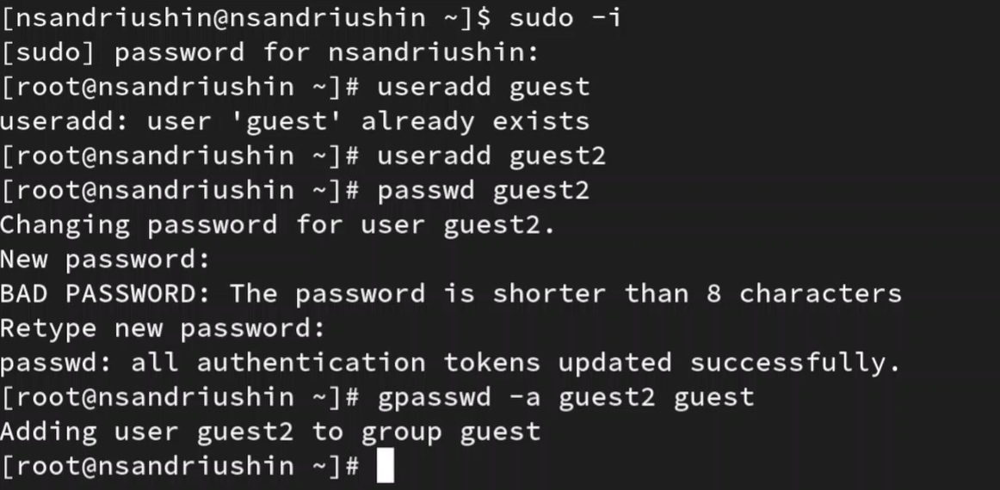
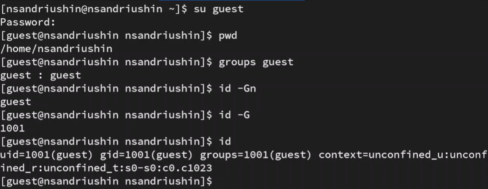
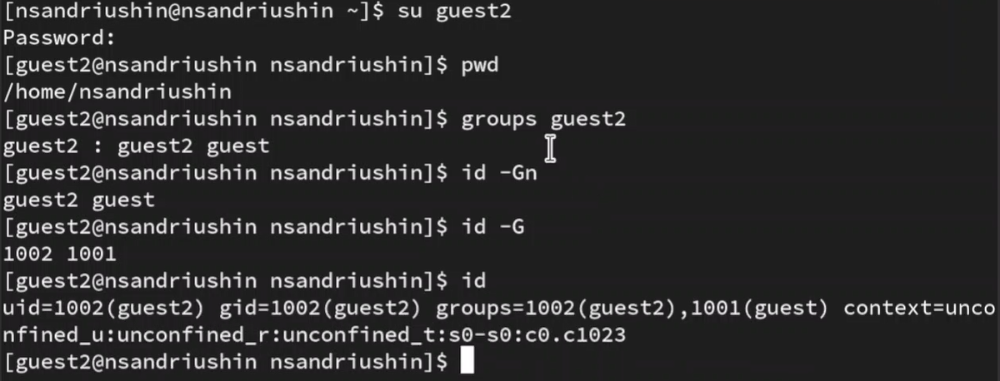
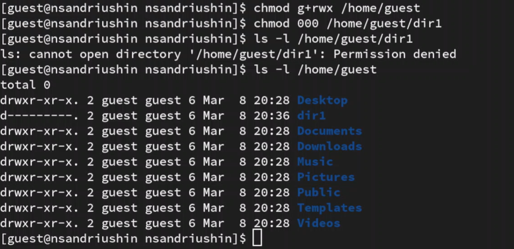

---
## Front matter
lang: ru-RU
title: Лабораторная работа
subtitle: Номер 3
author:
  - Андрюшин Н. С. 
institute:
  - Российский университет дружбы народов, Москва, Россия
date: 01 января 1970

## i18n babel
babel-lang: russian
babel-otherlangs: english

## Formatting pdf
toc: false
toc-title: Содержание
slide_level: 2
aspectratio: 169
section-titles: true
theme: metropolis
header-includes:
 - \metroset{progressbar=frametitle,sectionpage=progressbar,numbering=fraction}

## Fonts
mainfont: IBM Plex Serif
romanfont: IBM Plex Serif
sansfont: IBM Plex Sans
monofont: IBM Plex Mono
mathfont: STIX Two Math
mainfontoptions: Ligatures=Common,Ligatures=TeX,Scale=0.94
romanfontoptions: Ligatures=Common,Ligatures=TeX,Scale=0.94
sansfontoptions: Ligatures=Common,Ligatures=TeX,Scale=MatchLowercase,Scale=0.94
monofontoptions: Scale=MatchLowercase,Scale=0.94,FakeStretch=0.9
mathfontoptions:
---

# Информация

## Докладчик

:::::::::::::: {.columns align=center}
::: {.column width="70%"}

  * Андрюшин Никита Сергеевич
  * Студент
  * Российский университет дружбы народов

:::
::: {.column width="30%"}

:::
::::::::::::::

## Цель работы

Получение практических навыков работы в консоли с атрибутами файлов для групп пользователей

## Создание пользователей

Создадим 2 пользователей и добавим пользователя guest2 в группу guest 

{height=60%}

## guest

Создадим новое окно терминала, где авторизируемся как guest. Посмотрим его группы и то, в какой директории мы находимся 

{height=60%}

## guest2

Аналогичные действия делаем для guest2 

{height=60%}

## cat /etc/group

Убедимся в том, что пользователи находятся в тех группах, которые мы указали 

{height=60%}

## newgrp guest

Зарегистрируем guest2 в группе guest

{height=60%}

## Изменение прав

Далее изменим права на чтение и запись для домашней директории guest 

{height=60%}

## Выводы

В результате выполнения лабораторной работы были расширены навыки работы с дискреционным управлением доступа
