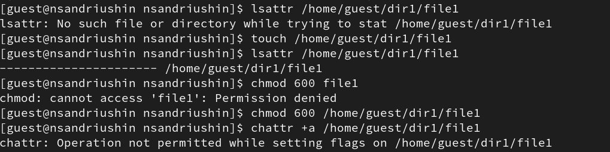
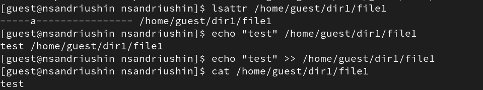
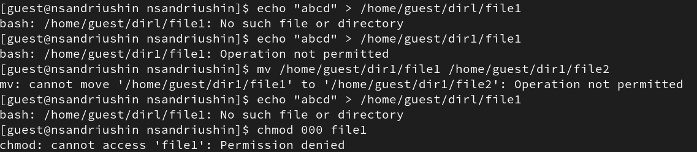
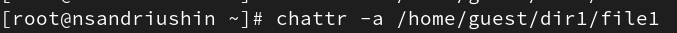
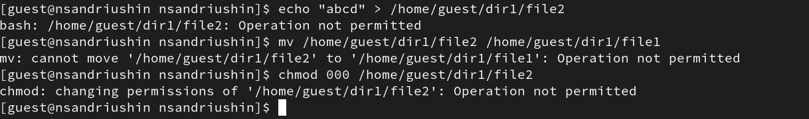

---
## Front matter
lang: ru-RU
title: Лабораторная работа
subtitle: Номер 4
author:
  - Андрюшин Н. С. 
institute:
  - Российский университет дружбы народов, Москва, Россия
date: 01 января 1970

## i18n babel
babel-lang: russian
babel-otherlangs: english

## Formatting pdf
toc: false
toc-title: Содержание
slide_level: 2
aspectratio: 169
section-titles: true
theme: metropolis
header-includes:
 - \metroset{progressbar=frametitle,sectionpage=progressbar,numbering=fraction}

## Fonts
mainfont: IBM Plex Serif
romanfont: IBM Plex Serif
sansfont: IBM Plex Sans
monofont: IBM Plex Mono
mathfont: STIX Two Math
mainfontoptions: Ligatures=Common,Ligatures=TeX,Scale=0.94
romanfontoptions: Ligatures=Common,Ligatures=TeX,Scale=0.94
sansfontoptions: Ligatures=Common,Ligatures=TeX,Scale=MatchLowercase,Scale=0.94
monofontoptions: Scale=MatchLowercase,Scale=0.94,FakeStretch=0.9
mathfontoptions:
---

# Информация

## Докладчик

:::::::::::::: {.columns align=center}
::: {.column width="70%"}

  * Андрюшин Никита Сергеевич
  * Студент
  * Российский университет дружбы народов

:::
::: {.column width="30%"}

:::
::::::::::::::

## Цель работы

Получение практических навыков работы в консоли с расширенными атрибутами файлов

## Расширенный атрибут

Для начала посмотрим расширенные атрибуты файла file1 и убедимся, что их нет. Поставим права на запись и чтение для владельца, после чего попробуем добавить расширенный атрибут, что закончится неудачей 

{heigh=60%}

## Успешное добавление атрибута

Расширенный атрибут -a можно поставить только от лица супер-пользователя 

{heigh=60%}

## Дозапись в файл

Убедимся в том, что атрибут добавлен. После этого попробуем что-нибудь дозаписать в файл. Операция успешна

{heigh=60%}

## Недозволенные операции

Однако, при перезаписи операция не дозволена. Кроме того, недозволено переименование и изменение прав 

{heigh=60%}

## Удаление атрибута

Уберём атрибут 

{heigh=60%}

## Теперь дозволенные операции

Теперь все действия доступны 

{heigh=60%}

## Добавление атрибута -i

Добавим атрибут -i 

{heigh=60%}

## Недозволенные операции

Попробуем сделать те же операции. Как видим, они все запрещены 

{heigh=60%}

## Выводы

В результате выполнения лабораторной работы были получены навыки работы с расширенными атрибутами
