---
## Front matter
lang: ru-RU
title: Лабораторная работа
subtitle: Номер 1
author:
  - Андрюшин Н. С. 
institute:
  - Российский университет дружбы народов, Москва, Россия
date: 01 января 1970

## i18n babel
babel-lang: russian
babel-otherlangs: english

## Formatting pdf
toc: false
toc-title: Содержание
slide_level: 2
aspectratio: 169
section-titles: true
theme: metropolis
header-includes:
 - \metroset{progressbar=frametitle,sectionpage=progressbar,numbering=fraction}

## Fonts
mainfont: IBM Plex Serif
romanfont: IBM Plex Serif
sansfont: IBM Plex Sans
monofont: IBM Plex Mono
mathfont: STIX Two Math
mainfontoptions: Ligatures=Common,Ligatures=TeX,Scale=0.94
romanfontoptions: Ligatures=Common,Ligatures=TeX,Scale=0.94
sansfontoptions: Ligatures=Common,Ligatures=TeX,Scale=MatchLowercase,Scale=0.94
monofontoptions: Scale=MatchLowercase,Scale=0.94,FakeStretch=0.9
mathfontoptions:
---

# Информация

## Докладчик

:::::::::::::: {.columns align=center}
::: {.column width="70%"}

  * Андрюшин Никита Сергеевич
  * Студент
  * Российский университет дружбы народов

:::
::: {.column width="30%"}

:::
::::::::::::::

## Цель работы

Изучение механизмов изменения идентификаторов, применения
SetUID- и Sticky-битов. Получение практических навыков работы в консоли с дополнительными атрибутами. Рассмотрение работы механизма смены идентификатора процессов пользователей, а также влияние бита Sticky на запись и удаление файлов

## Создание файла

Для начала создадим файл с кодом 

{height=60%}

## Код

И запишем туда следующий код 

{height=60%}{#fig:002}

## Тестирование программы

Скомпилируем программу и запустим её. Как видим, она практически идентична команде id

{height=60%}

## Код новой программы

Создадим новую программу

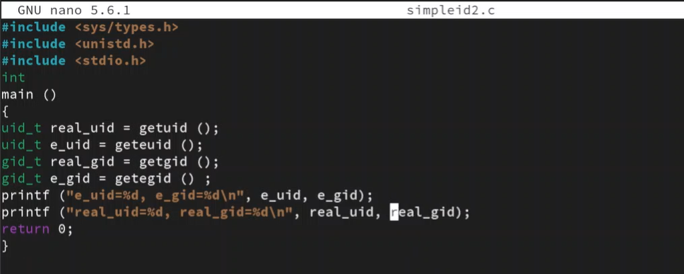{height=60%}

## Запуск программы

также скомпилируем её и запустим 

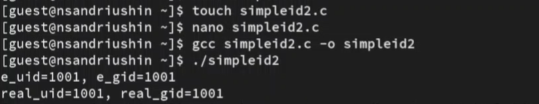{height=60%}

## Смена владельца и suid

Теперь поменяем для скомпилированной программы владельца и установим suid 

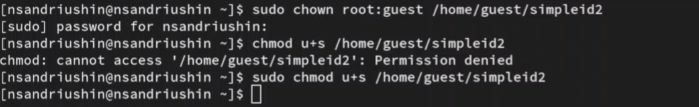{height=60%}

## Запуск программы

убедимся, что изменения успешны и запустим программу. Как видим, теперь вывод e_uid равен 0, так как программа теперь запускается от имени root 

{height=60%}

## Смена владельца-гуппы и sgid

Теперь сменим группу и установим sgid 

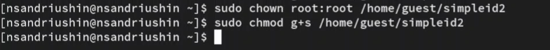{height=60%}

## Запуск программы

Убедимся в успешном изменении и запустим программу. Теперь e_gid равен 0, так как программу запускается от имени группы root 

{height=60%}

## Код

Создадим новый файл, и напишем туда код 

{height=60%}

## Смена прав и владельца

Сменим для файла исходного кода владельца и уберём права для посторонних пользователей

{height=60%}

## Компиляция и попытка открытия исходника

Скомпилируем программу и попробуем открыть исходный код 

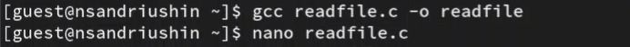{height=60%}

## Отказ в чтении

Как видим, чтение запрещено 

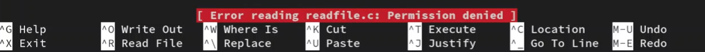{height=60%}

## Смена владельца и suid

Теперь сменим для исполняемого файла владельца и установим suid 

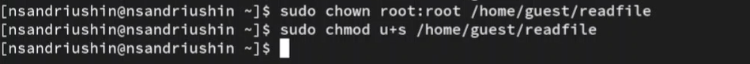{height=60%}

## Успешное чтение файла

Попробуем с помощью программы прочитать исходный код, и это успешно получается 

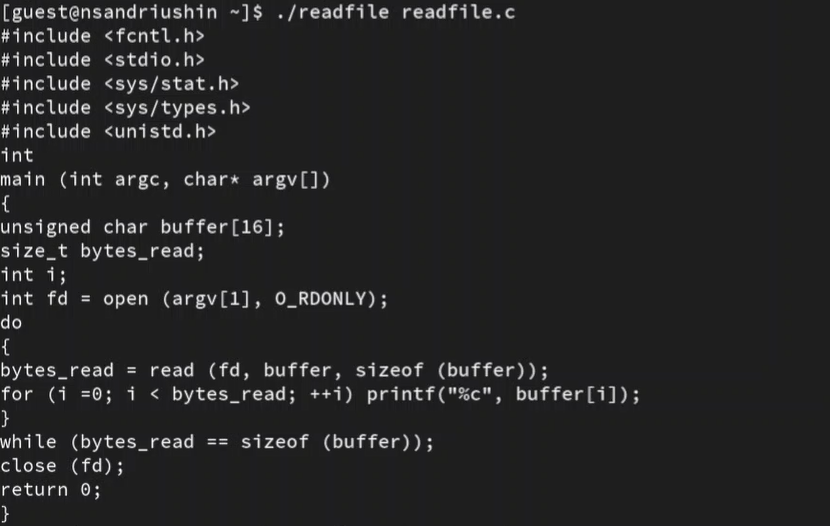{height=60%}

## Чтение /etc/shadow

Попробуем прочитать файл /etc/shadow, что успешно получается 

{height=60%}

## Stickybit

Теперь посмотрим, есть ли на папке /tmp stickybit. После этого создадим отлица пользователя guest файл, куда запишем 1 слово и позволим для посторонних чтение и запись

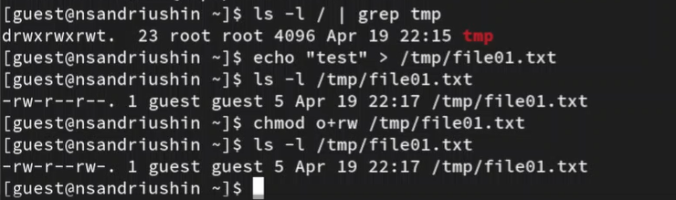{height=60%}

## Неуспешные операции

От лица другого пользователя пытаемся дозаписать что-то в файл, записать что-то в файл и удалить этот файл. Все операции неуспешны 

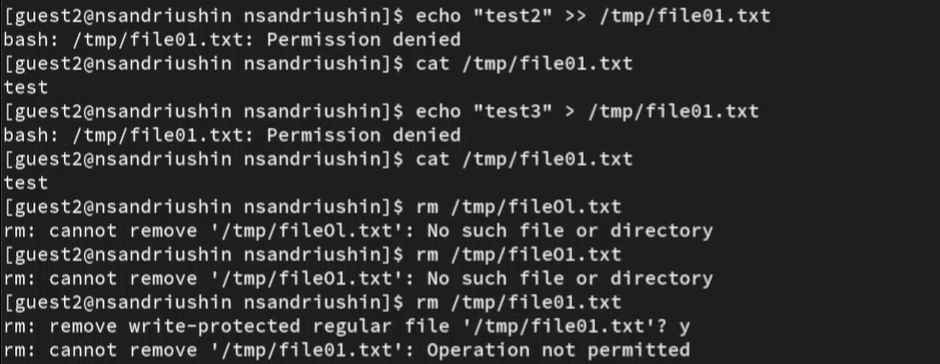{height=60%}

## Операции без Stickybit

Снимем Stickybit и попробуем повторить эти операции. Теперь получилось удалить файл 

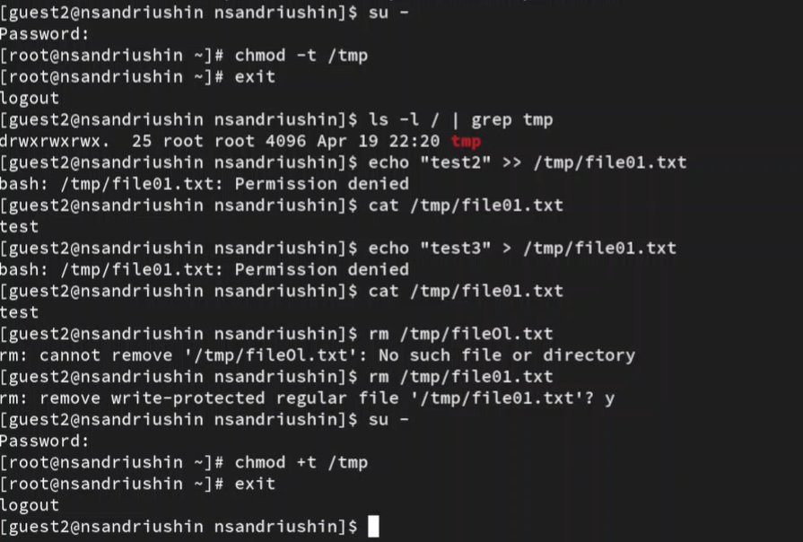{height=60%}

## Выводы

В результате выполнения лабораторной работы были получены знания механизмов изменения идентификаторов, применения
SetUID- и Sticky-битов
