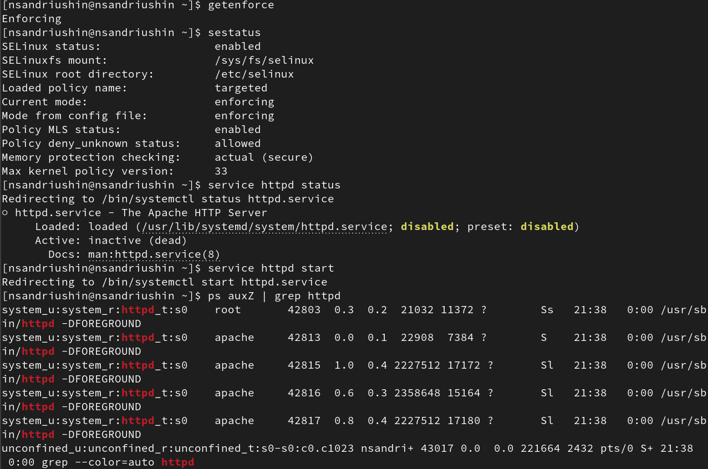
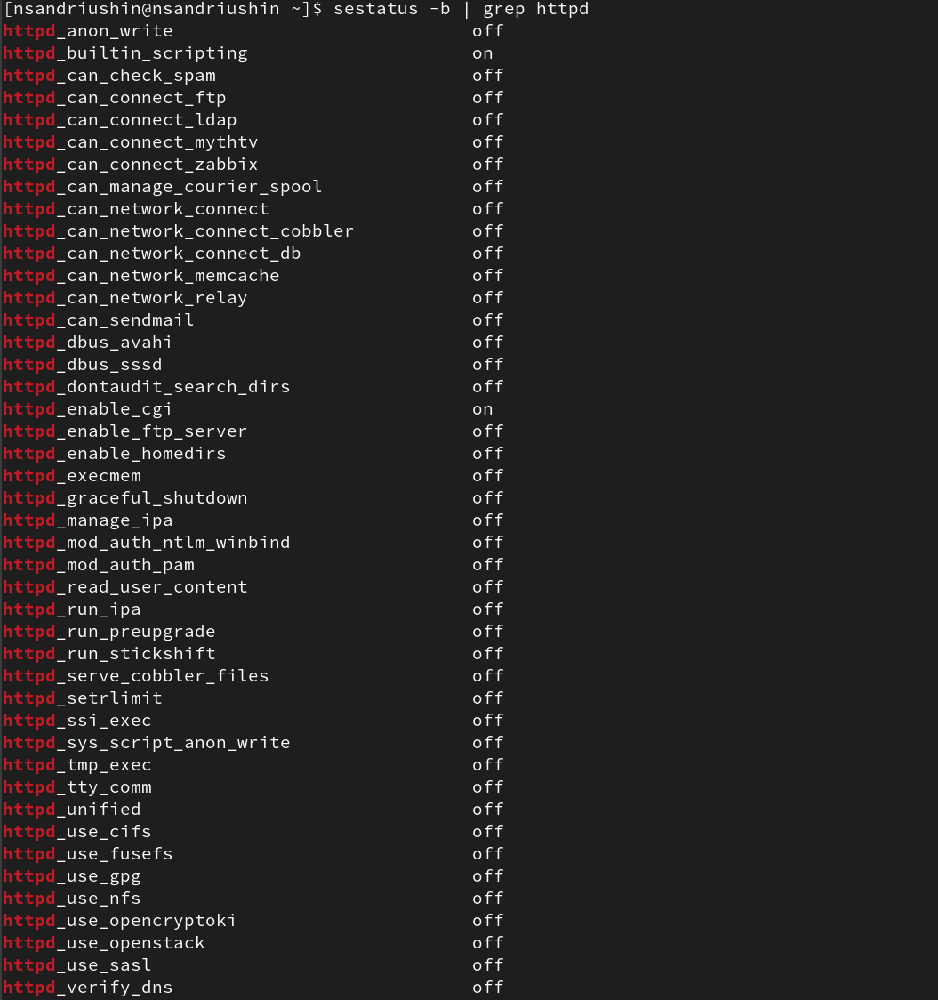
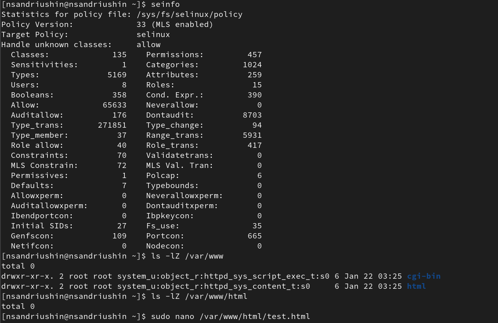
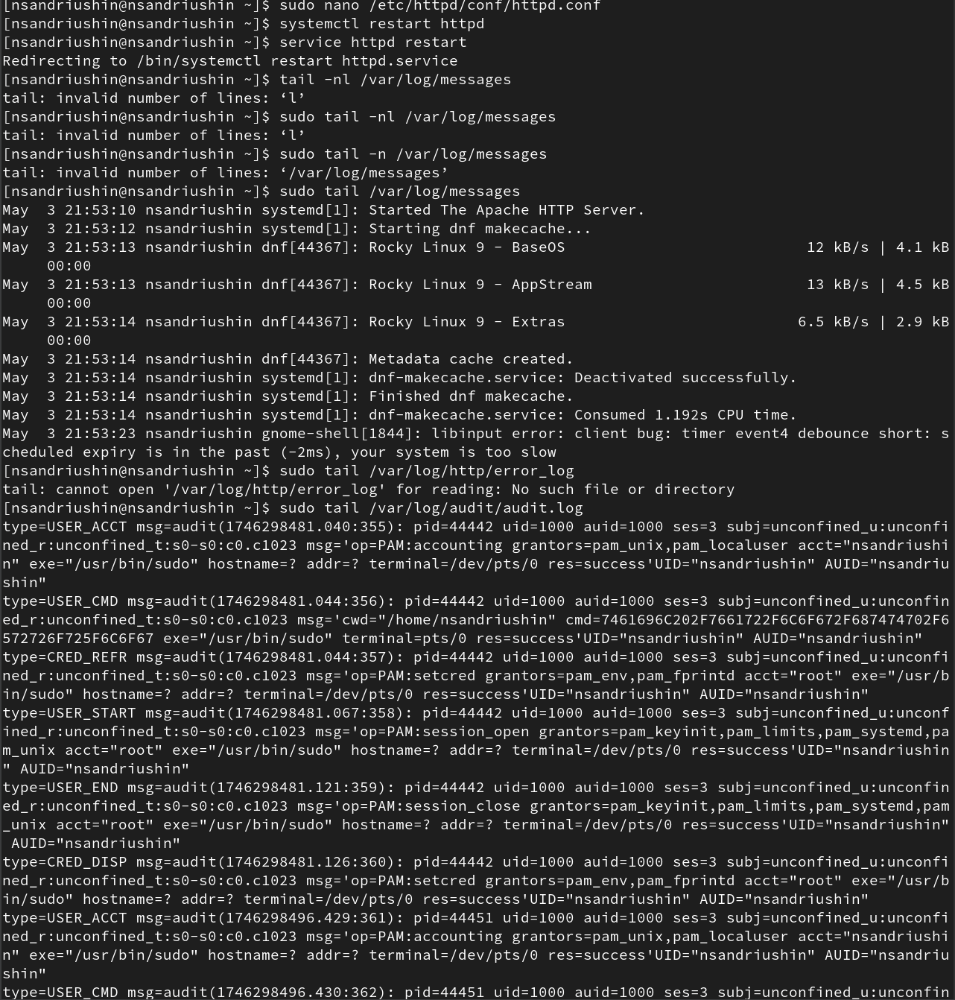

---
## Front matter
lang: ru-RU
title: Лабораторная работа
subtitle: Номер 6
author:
  - Андрюшин Н. С. 
institute:
  - Российский университет дружбы народов, Москва, Россия
date: 01 января 1970

## i18n babel
babel-lang: russian
babel-otherlangs: english

## Formatting pdf
toc: false
toc-title: Содержание
slide_level: 2
aspectratio: 169
section-titles: true
theme: metropolis
header-includes:
 - \metroset{progressbar=frametitle,sectionpage=progressbar,numbering=fraction}

## Fonts
mainfont: IBM Plex Serif
romanfont: IBM Plex Serif
sansfont: IBM Plex Sans
monofont: IBM Plex Mono
mathfont: STIX Two Math
mainfontoptions: Ligatures=Common,Ligatures=TeX,Scale=0.94
romanfontoptions: Ligatures=Common,Ligatures=TeX,Scale=0.94
sansfontoptions: Ligatures=Common,Ligatures=TeX,Scale=MatchLowercase,Scale=0.94
monofontoptions: Scale=MatchLowercase,Scale=0.94,FakeStretch=0.9
mathfontoptions:
---

# Информация

## Докладчик

:::::::::::::: {.columns align=center}
::: {.column width="70%"}

  * Андрюшин Никита Сергеевич
  * Студент
  * Российский университет дружбы народов

:::
::: {.column width="30%"}

:::
::::::::::::::

## Цель работы

Развить навыки администрирования ОС Linux. Получить первое практическое знакомство с технологией SELinux. Проверить работу SELinx на практике совместно с веб-сервером Apache.

## Режим SELinux

Проверим,что SELinux работает в режиме enfording

{height=60%}

## Переключатели SELinux

Посмотрим переключатели SELinux для httpd 

{height=60%}

## seinfo

Посмотрим на количество типов, пользователей и ролей с помощью команды seinfo 

{height=60%}

## /var/www/html/test.html

Создадим файл /var/www/html/test.html и заполним его одним словом 

{height=60%}

## Открытие страницы

При открытии браузера открывается созданная нами страница 

{height=60%}

## Смена метки

Далее посмотрим на метки в директории /var/www/html/ и попробуем сменить метку созданного нами файла и посмотрим логи 

{height=60%}

## Доступ запрещён

После смены метки доступ к странице был запрещён

{height=60%}

## Смена порта

Поменяем порт на 81 вместо 80 

{height=60%}

## Перезагрузка службы

Перезагрузим службу. После этого мы не сможем зайти на нашу страницу. Об этом также будут писать логи 

{height=60%}

## Добавление порта и возврат к первоначальной конфигурации

Для того, чтобы получилось зайти, досаточно добавить 81 порт в semanage. После Этого вернём всё как было 

{height=60%}

## Работающий сайт

При добавленном порте сайт работает, но нам нужно указать, что мы обращаемся именно к 81 порту 

{height=60%}

## Смена порта обратно

Меняем теперь порт отбратно 

{height=60%}

## Выводы

В результате выполнения лабораторной работы было получено понимание работы мандатного разграничения доступа
