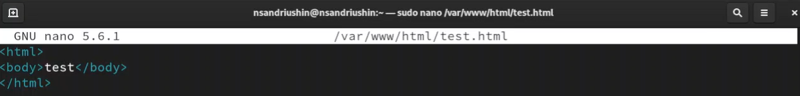
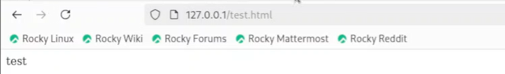
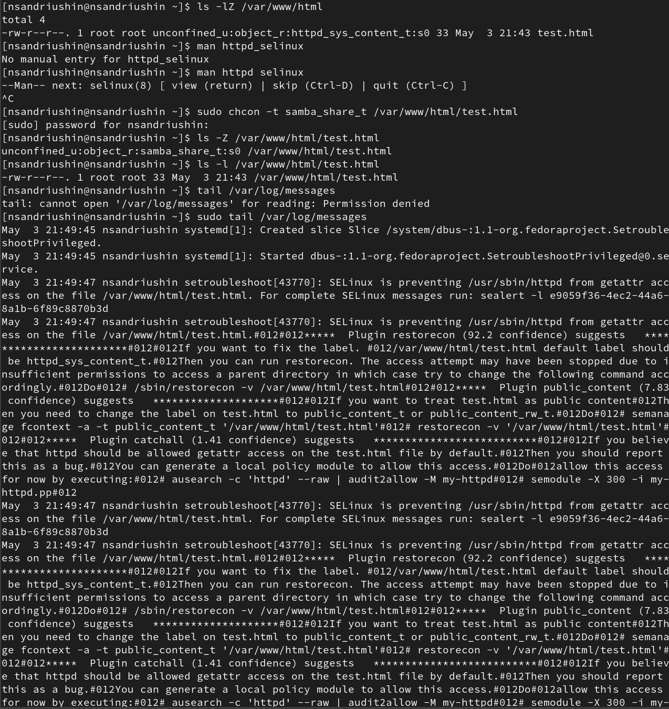
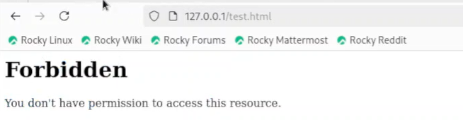
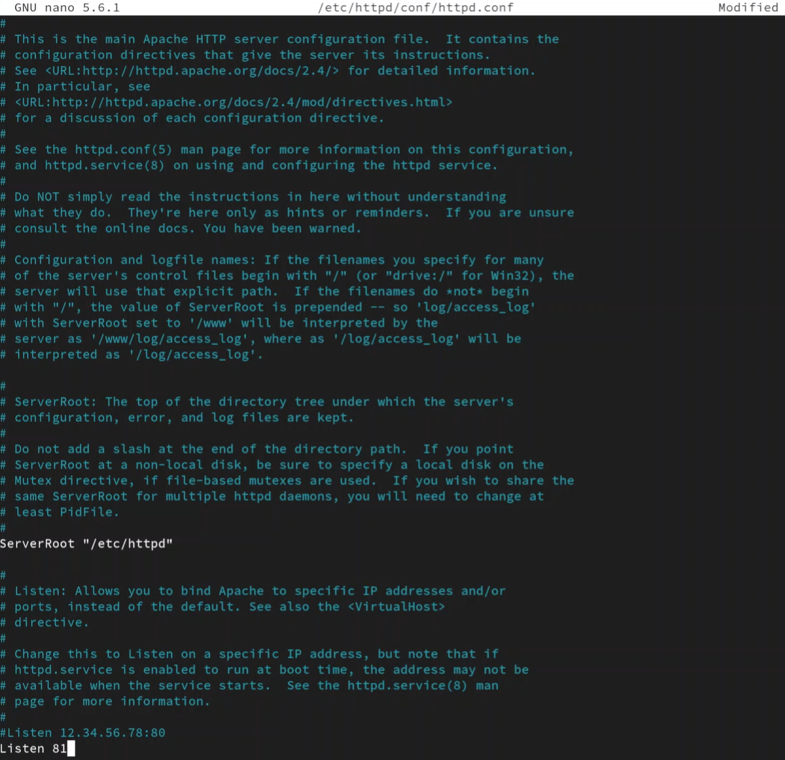
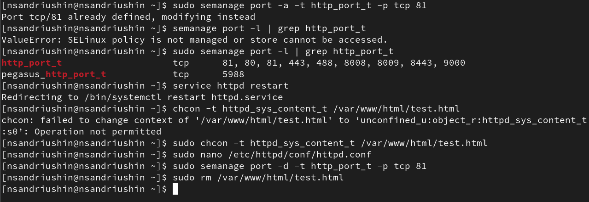
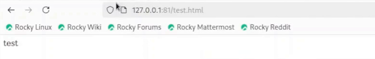
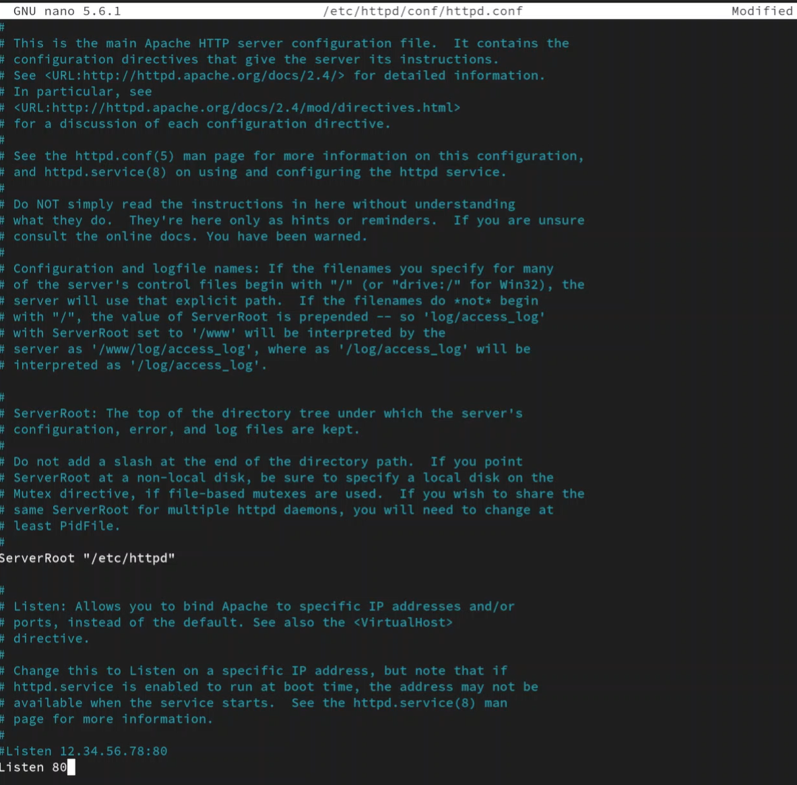

---
## Front matter
title: "Отчёт о лабораторной работе"
subtitle: "Лабораторная работа 6"
author: "Андрюшин Никита Сергеевич"

## Generic otions
lang: ru-RU
toc-title: "Содержание"

## Bibliography
bibliography: bib/cite.bib
csl: pandoc/csl/gost-r-7-0-5-2008-numeric.csl

## Pdf output format
toc: true # Table of contents
toc-depth: 2
lof: true # List of figures
lot: true # List of tables
fontsize: 12pt
linestretch: 1.5
papersize: a4
documentclass: scrreprt
## I18n polyglossia
polyglossia-lang:
  name: russian
  options:
	- spelling=modern
	- babelshorthands=true
polyglossia-otherlangs:
  name: english
## I18n babel
babel-lang: russian
babel-otherlangs: english
## Fonts
mainfont: IBM Plex Serif
romanfont: IBM Plex Serif
sansfont: IBM Plex Sans
monofont: IBM Plex Mono
mathfont: STIX Two Math
mainfontoptions: Ligatures=Common,Ligatures=TeX,Scale=0.94
romanfontoptions: Ligatures=Common,Ligatures=TeX,Scale=0.94
sansfontoptions: Ligatures=Common,Ligatures=TeX,Scale=MatchLowercase,Scale=0.94
monofontoptions: Scale=MatchLowercase,Scale=0.94,FakeStretch=0.9
mathfontoptions:
## Biblatex
biblatex: true
biblio-style: "gost-numeric"
biblatexoptions:
  - parentracker=true
  - backend=biber
  - hyperref=auto
  - language=auto
  - autolang=other*
  - citestyle=gost-numeric
## Pandoc-crossref LaTeX customization
figureTitle: "Рис."
tableTitle: "Таблица"
listingTitle: "Листинг"
lofTitle: "Список иллюстраций"
lotTitle: "Список таблиц"
lolTitle: "Листинги"
## Misc options
indent: true
header-includes:
  - \usepackage{indentfirst}
  - \usepackage{float} # keep figures where there are in the text
  - \floatplacement{figure}{H} # keep figures where there are in the text
---

# Цель работы

Развить навыки администрирования ОС Linux. Получить первое практическое знакомство с технологией SELinux. Проверить работу SELinx на практике совместно с веб-сервером Apache.

# Выполнение лабораторной работы

Проверим,что SELinux работает в режиме enfording (рис. [-@fig:001]).

{#fig:001}

Посмотрим переключатели SELinux для httpd (рис. [-@fig:002]).

{#fig:002}

Посмотрим на количество типов, пользователей и ролей с помощью команды seinfo (рис. [-@fig:003]).

{#fig:003}

Создадим файл /var/www/html/test.html и заполним его одним словом (рис. [-@fig:004]).

{#fig:004}

При открытии браузера открывается созданная нами страница (рис. [-@fig:005]).

{#fig:005}

Далее посмотрим на метки в директории /var/www/html/ и попробуем сменить метку созданного нами файла и посмотрим логи (рис. [-@fig:006]).

{#fig:006}

После смены метки доступ к странице был запрещён (рис. [-@fig:007]).

{#fig:007}

Поменяем порт на 81 вместо 80 (рис. [-@fig:008]).

{#fig:008}

Перезагрузим службу. После этого мы не сможем зайти на нашу страницу. Об этом также будут писать логи (рис. [-@fig:009]).

{#fig:009}

Для того, чтобы получилось зайти, досаточно добавить 81 порт в semanage. После Этого вернём всё как было (рис. [-@fig:010]).

{#fig:010}

При добавленном порте сайт работает, но нам нужно указать, что мы обращаемся именно к 81 порту (рис. [-@fig:011]).

{#fig:011}

Меняем теперь порт отбратно (рис. [-@fig:012]).

{#fig:012}

# Выводы

В результате выполнения лабораторной работы было получено понимание работы мандатного разграничения доступа

# Список литературы{.unnumbered}

::: {#refs}
:::
