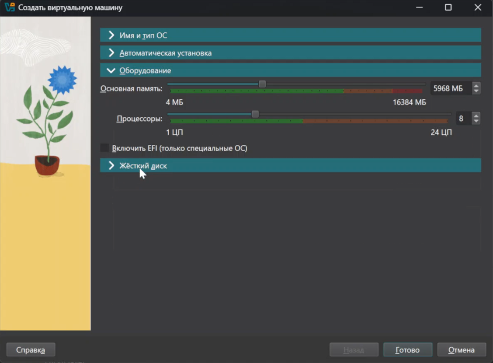
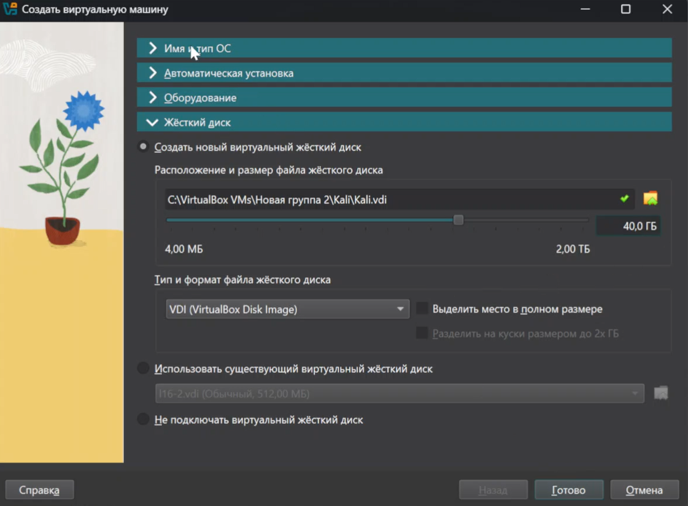
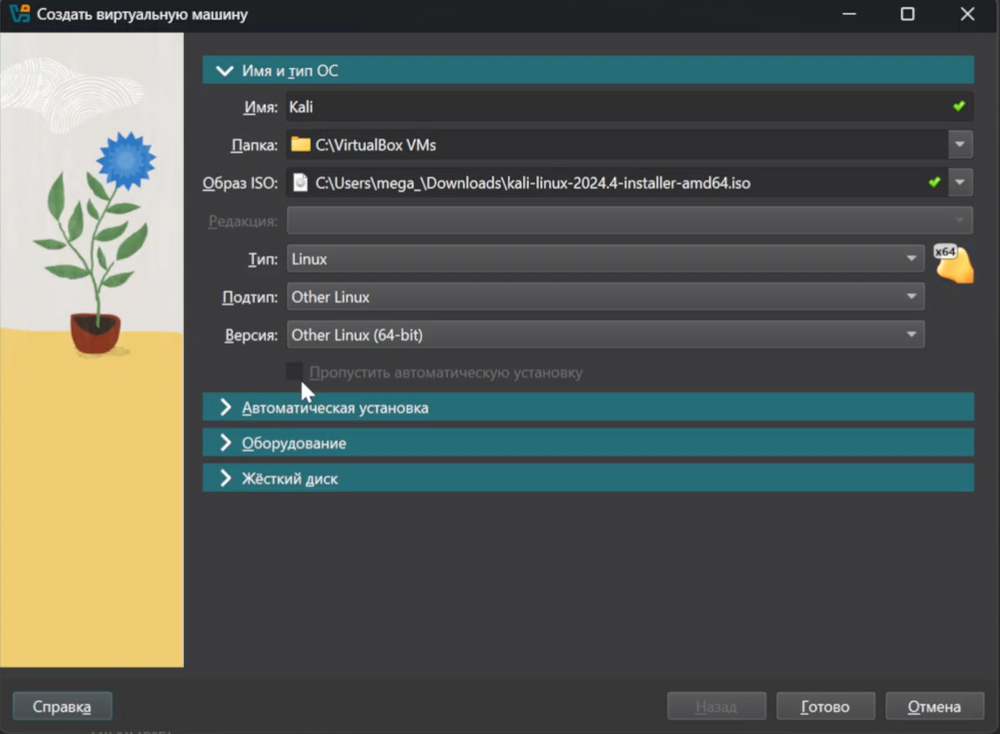
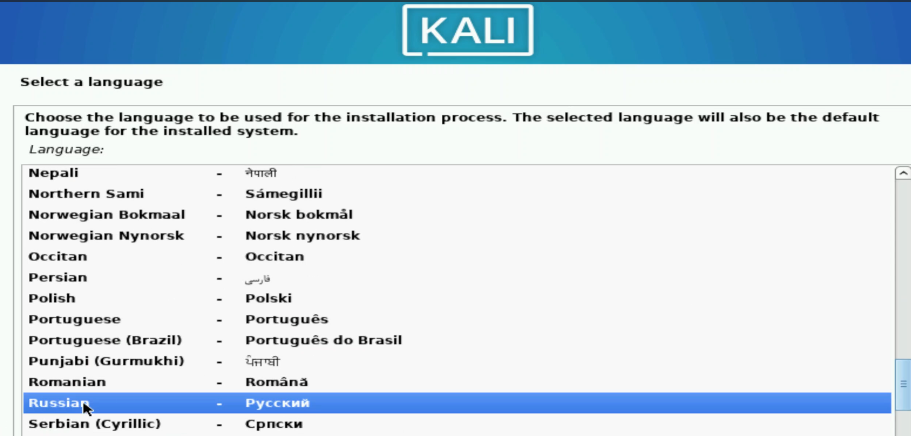
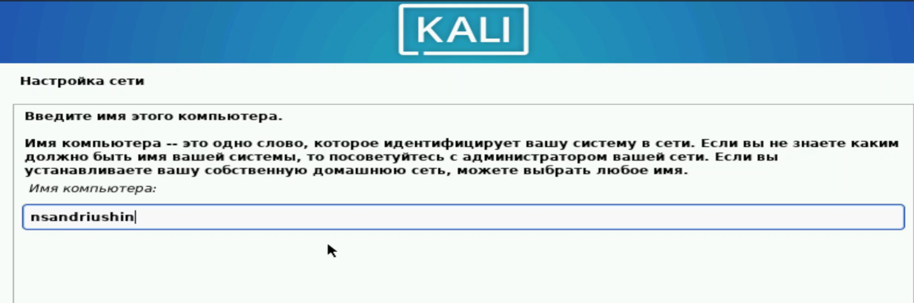
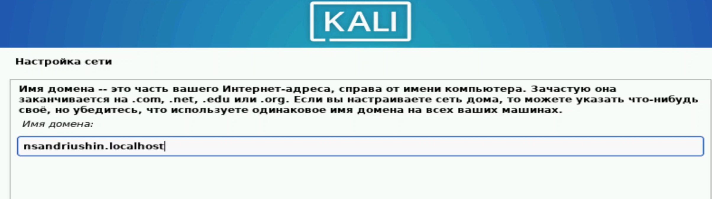
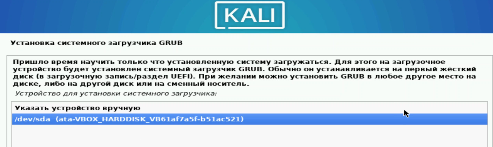

---
## Front matter
lang: ru-RU
title: Лабораторная работа
subtitle: Проект стадия 1
author:
  - Андрюшин Н. С. 
institute:
  - Российский университет дружбы народов, Москва, Россия
date: 01 января 1970

## i18n babel
babel-lang: russian
babel-otherlangs: english

## Formatting pdf
toc: false
toc-title: Содержание
slide_level: 2
aspectratio: 169
section-titles: true
theme: metropolis
header-includes:
 - \metroset{progressbar=frametitle,sectionpage=progressbar,numbering=fraction}

## Fonts
mainfont: IBM Plex Serif
romanfont: IBM Plex Serif
sansfont: IBM Plex Sans
monofont: IBM Plex Mono
mathfont: STIX Two Math
mainfontoptions: Ligatures=Common,Ligatures=TeX,Scale=0.94
romanfontoptions: Ligatures=Common,Ligatures=TeX,Scale=0.94
sansfontoptions: Ligatures=Common,Ligatures=TeX,Scale=MatchLowercase,Scale=0.94
monofontoptions: Scale=MatchLowercase,Scale=0.94,FakeStretch=0.9
mathfontoptions:
---

# Информация

## Докладчик

:::::::::::::: {.columns align=center}
::: {.column width="70%"}

  * Андрюшин Никита Сергеевич
  * Студент
  * Российский университет дружбы народов

:::
::: {.column width="30%"}

:::
::::::::::::::

## Цель работы

Установить Kali Linux

## Выделение памяти и процессоров

Выделим память и процессоры

{height=60%}

## Выделение диска

Выделим диск

{height=60%}

## Выбор образа

Выберим загрузочный образ и имя VM 

{height=60%}

## Настройка языка

После запуска выберем русский язык

{height=60%}

## Клавиша переключения языка

Настроим клавишу для переключения языка 

{height=60%}

## Имя компьютера

ВЫберем имя для компьютера 

{height=60%}

## Имя домена

Выберем имя домена 

{height=60%}

## Имя пользователя

Выберем имя пользователя 

{height=60%}

## Пароль

Настроим пароль

{height=60%}

## Часовой пояс

Настроим часовой пояс

{height=60%}

## Разметка дисков

Сделаем авто разметку дисков

{height=60%}

## Диск для установки

Выберем диск для установки 

{height=60%}

## Подтверждение разметки

Подтвердим разметку

{height=60%}

## Дополнительные параметры установки

Настроим дополнительные параметры установки 

{height=60%}

## Grub

Укажем раздел установки для grub 

{height=60%}

## Завершение установки

Завершение установки 

{height=60%}

## Выводы

В результате выполнения лабораторной работы был установлен kali linux
