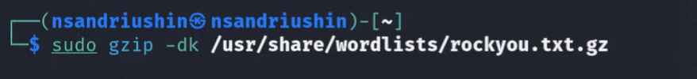
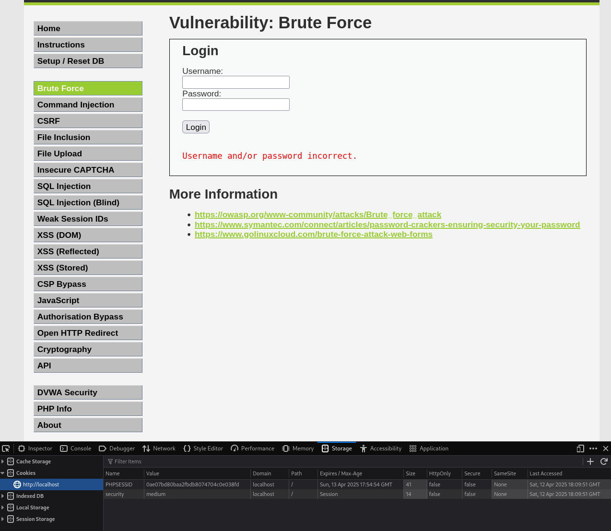
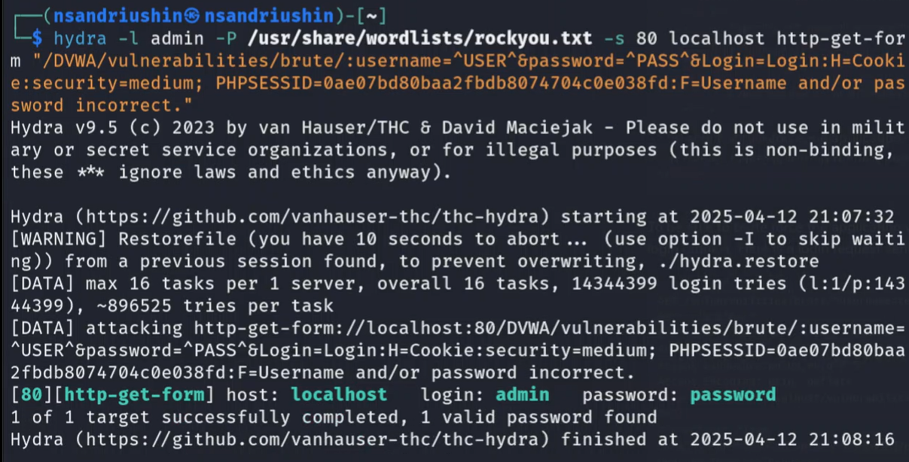
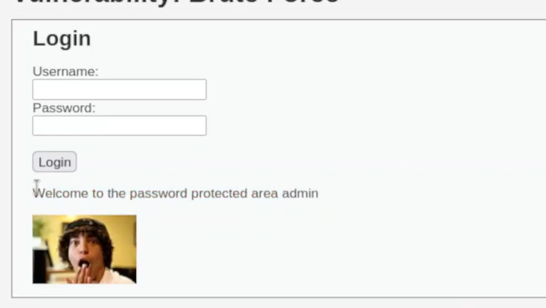

---
## Front matter
lang: ru-RU
title: Лабораторная работа
subtitle: Проект стадия 3
author:
  - Андрюшин Н. С. 
institute:
  - Российский университет дружбы народов, Москва, Россия
date: 01 января 1970

## i18n babel
babel-lang: russian
babel-otherlangs: english

## Formatting pdf
toc: false
toc-title: Содержание
slide_level: 2
aspectratio: 169
section-titles: true
theme: metropolis
header-includes:
 - \metroset{progressbar=frametitle,sectionpage=progressbar,numbering=fraction}

## Fonts
mainfont: IBM Plex Serif
romanfont: IBM Plex Serif
sansfont: IBM Plex Sans
monofont: IBM Plex Mono
mathfont: STIX Two Math
mainfontoptions: Ligatures=Common,Ligatures=TeX,Scale=0.94
romanfontoptions: Ligatures=Common,Ligatures=TeX,Scale=0.94
sansfontoptions: Ligatures=Common,Ligatures=TeX,Scale=MatchLowercase,Scale=0.94
monofontoptions: Scale=MatchLowercase,Scale=0.94,FakeStretch=0.9
mathfontoptions:
---

# Информация

## Докладчик

:::::::::::::: {.columns align=center}
::: {.column width="70%"}

  * Андрюшин Никита Сергеевич
  * Студент
  * Российский университет дружбы народов

:::
::: {.column width="30%"}

:::
::::::::::::::

## Цель работы

Разобраться в работе Hydra

## Разархивация паролей

Для начала распакуем архив с базой данных паролей 

{height=60%}

## Данные с сайта DVWA

Далее попробуем сломать одно из окон авторизации DVWA. Запомним фразу, которая высвечивается при неправильном пароле, а также данные куки снизу 

{height=60%}

## Использование Hydra

Теперь воспользуемся гидрой. Укажем ей файл с паролями и адрес ломаемого сайта. Укажем также данные куки и фразу, выводящуюся при неверной авторизации, что будет подсказкой для гидры, что пароль неверный. В результате, получаем пароль 

{height=60%}

## Успешная авторизация

Вводим пароль на сайт 

{height=60%}

## Выводы

В результате выполнения лабораторной работы были получены навыки работы с hydra
